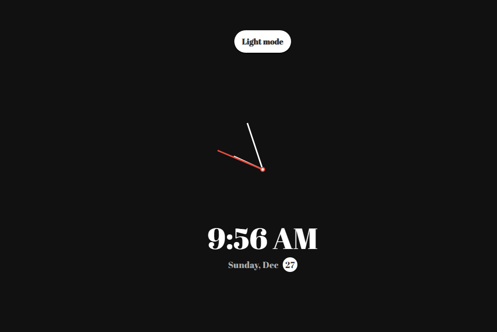

# Theme Clock

> Theme Clock on Vanilla JS
> 
### [Demo](http://theme-clock-ab.surge.sh)
[](https://skr.sh/v5pazPr2nEo?a)

### Get started

```shell script
git clone
```
```shell script
open index.html
```
or
```shell script
npm i -g live-server
```
```shell script
live-server
```
